# My 10 takeaways from the 2019 Intelligent Vehicle Symposium

!!!! WORK IN PROGRESS !!!!

|   |
|:--:|
| *2019 Intelligent Vehicle Symposium* |

```TL; DR

- Look how other industries (e.g. aviation) deal with risk assessment and decision making under uncertainty.
- Abandon the *Vision Zero* buzzword.
- Stop separating prediction and planning and use POMDP formulations.
- Combine learning and planning (e.g. MCTS + RL).
- ... # todo
```

Last week, experts from the autonomous driving (AD) world came together for the 2019 IEEE Intelligent Vehicle Symposium ([IV19](https://iv2019.org/)) in Paris to discuss about research and applications for autonomous driving.

This **30th edition** included one full day of **workshops and tutorials**, two days of **oral presentations**, **poster sessions** and **keynotes** as well as one whole day of **on-track demonstrations**. Not to mention the several **social events** that were ideal for deeper discussions and intense debates.

Some interesting figures:

- Around `700` attendees.
- `525` paper submissions.
- `62%` acceptance rate.
- More than `1100` reviewers.
- Authors coming from `37` countries, with almost **one third from Germany**, `16%` China, `14%` USA, `7%` France, `5%` Japan. *I sometime felt more in Germany than in France!*

From the [List of Events for Autonomous Driving Engineers and Researchers](https://github.com/esrlabs/Conferences-for-Autonomous-Driving), IV was identified as a top priority for our [Machine Learning Team](https://www.esrlabs.com/works/autonomous/). I would like to **thank [ESR Labs AG](https://www.esrlabs.com)** for this opportunity to exchange, during four days, with other engineers, researchers, practitioners, and students, from industry, universities and government agencies about the latest trends, insights and challenges related to the fast-moving field of AD.

In this post, I would like to **share some personal highlights** about the latest exciting trends in decision making for autonomous driving.

Disclaimers:

- These notes are **personal highlights** and do **not aim at being an exhausted review** of the IV19 publications.
- I mainly focus on the topic of **decision making for AD** (as opposed to perceptions, localisation or control for instance).
- Many subjects I am discussing are new to me. I really hope I did not misinterpret any concept when referencing to papers. Please notify me if any statement or interpretation is incorrect!

## The Last Word

IV19 was my first scientific symposium. I could meet leading-edge researchers and engineers in my domain of interest while broadening my perspectives on other AD topics.

Again, many thanks at [ESR Labs AG](https://www.esrlabs.com) for this great opportunity. I am now looking forward to implementing the learnt lessons to [some of our projects](https://www.esrlabs.com/works/autonomous).

### Save The Date - an money :bowtie:

[IV20](https://2020.ieee-iv.org/) will take place in Las Vegas, June 23-26, while Japan will host IV21, with probably a lot of amazing demos to show after the 2020 Olympics.

|   |
|:--:|
| *Brendan Morris advertising IV20. Source: author provided* |

## References

[Akai, Naoki et al.] 2019.
**“Driving Behavior Modeling Based on Hidden Markov Models with Driver’s Eye-Gaze Measurement and Ego-Vehicle Localization”**
[[pdf]](https://www.researchgate.net/publication/332543438_Driving_Behavior_Modeling_Based_on_Hidden_Markov_Models_with_Driver%27s_Eye-Gaze_Measurement_and_Ego-Vehicle_Localization)]

[Alahi, Alexandre et al.] 2016.
**“Social LSTM: Human Trajectory Prediction in Crowded Spaces”**
[[pdf]](http://cvgl.stanford.edu/papers/CVPR16_Social_LSTM.pdf)]

[Barbier, Mathieu et al.] 2019.
**“Validation of Perception and Decision-Making Systems for Autonomous Driving via Statistical Model Checking”**
[[pdf]](https://hal.inria.fr/hal-02127889/document)]

[Barbier, Mathieu, Christian Laugier, Olivier Simonin, and Javier Ibanez-Guzmin.] 2018.
**“Probabilistic Decision-Making at Road Intersections: Formulation and Quantitative Evaluation”**
[[pdf]](https://hal.inria.fr/hal-01940392/document)]

[Bernhard, Julian, and Alois Knoll.] 2019.
**“Addressing Inherent Uncertainty: Risk-Sensitive Behavior Generation Using Distributional Reinforcement Learning”**
[[html]](https://mediatum.ub.tum.de/node?id=1485138)]

[Bouton, Maxime, Alireza Nakhaei, Kikuo Fujimura, and Mykel J Kochenderfer.] 2019.
**“Safe Reinforcement Learning with Scene Decomposition for Navigating Complex Urban Environments”**
[[pdf]](https://arxiv.org/abs/1904.11483)]

[Chauvin, Simon.] 2018.
**“Hierarchical Decision-Making for Autonomous Driving”**
[[pdf]](https://github.com/chauvinSimon/Hierarchical-Decision-Making-for-Autonomous-Driving)]

[Chen, Jianyu, Bodi Yuan, and Masayoshi Tomizuka.] 2019.
**“Model-Free Deep Reinforcement Learning for Urban Autonomous Driving”**
[[pdf]](http://arxiv.org/abs/1904.09503)]

[Chen, Longsheng et al.] 2019.
**“An Adaptive Path Tracking Controller Based on Reinforcement Learning with Urban Driving Application”**
[-]

[Diehl, Frederik, Thomas Brunner, Michael Truong Le, and Alois Knoll.] 2019.
**“Graph Neural Networks for Modelling Traffic Participant Interaction”**
[[pdf]](https://arxiv.org/abs/1903.01254)]

Driggs-Campbell, Katherine, Roy Dong, S. Shankar Sastry, and Ruzena Bajcsy.] 2017.
**“Robust, Informative Human-in-the-Loop Predictions via Empirical Reachable Sets”**
[[pdf]](https://arxiv.org/abs/1705.00748)]

[Esterle, Klemens, Vincent Aravantinos, and Alois Knoll.] 2019.
**“From Specifications to Behavior: Maneuver Verification in a Semantic State Space”**
[[pdf]](https://arxiv.org/abs/1905.00708)]

[Folkers, Andreas, Matthias Rick, and B Christof.] 2019.
**“Controlling an Autonomous Vehicle with Deep Reinforcement Learning”**
[-]

[Hartmann, Michael, and Daniel Watzenig.] 2019.
**“Optimal Motion Planning with Reachable Sets of Vulnerable Road Users”**
[-]

[Hoel, Carl-Johan et al.] 2019.
**“Combining Planning and Deep Reinforcement Learning in Tactical Decision Making for Autonomous Driving”**
[[pdf]](https://arxiv.org/abs/1905.02680)]

[Hu, Yeping, Wei Zhan, and Masayoshi Tomizuka.] 2019.
**“Multi-Modal Probabilistic Prediction of Interactive Behavior via an Interpretable Model”**
[[pdf]](https://arxiv.org/abs/1903.09381)]

[Hubmann, Constantin et al. 2019.]
**“A POMDP Maneuver Planner For Occlusions in Urban Scenarios”**
[-]

[Joonatan, Mänttäri, and John Folkesson.] 2019.
**“Incorporating Uncertainty in Predicting Vehicle Maneuvers at Intersections With Complex Interactions”**
[-]

[Kang, Yue, Hang Yin, and Christian Berger.] 2018.
**“Test Your Self-Driving Algorithm : An Overview of Publicly Available Driving Datasets and Virtual Testing Environments”**
[[pdf]](https://www.researchgate.net/publication/331723628_Test_Your_Self-Driving_Algorithm_An_Overview_of_Publicly_Available_Driving_Datasets_and_Virtual_Testing_Environments)]

[Kapania, Nitin R., Vijay Govindarajan, Francesco Borrelli, and J. Christian Gerdes.] 2019.
**“A Hybrid Control Design for Autonomous Vehicles at Uncontrolled Crosswalks”**
[[pdf]](https://arxiv.org/abs/1902.00597)]

[Klischat, Moritz, and Matthias Althoff.] 2019.
**“Generating Critical Test Scenarios for Automated Vehicles with Evolutionary Algorithms”**
[[pdf]](https://www.researchgate.net/publication/333186174_Generating_Critical_Test_Scenarios_for_Automated_Vehicles_with_Evolutionary_Algorithms)]

[Koenig, Alexander, Tobias Rehder, and Soeren Hohmann.] 2017.
**“Exact Inference and Learning in Hybrid Bayesian Networks for Lane Change Intention Classification”**
[[html]](https://ieeexplore.ieee.org/document/7995927/)]

[Kong, Jason, Mark Pfeiffer, Georg Schildbach, and Francesco Borrelli.] 2015.
**“Kinematic and Dynamic Vehicle Models for Autonomous Driving Control Design”**
[[pdf]](https://borrelli.me.berkeley.edu/pdfpub/IV_KinematicMPC_jason.pdf)]

[Lee, Namhoon et al.] 2017.
**“DESIRE : Distant Future Prediction in Dynamic Scenes with Interacting Agents”**
[[pdf]](https://arxiv.org/abs/1704.04394)]

[Li, Jiachen, Hengbo Ma, Wei Zhan, and Masayoshi Tomizuka.] 2019.
**“Coordination and Trajectory Prediction for Vehicle Interactions via Bayesian Generative Modeling”**
[[pdf]](http://arxiv.org/abs/1905.00587)]

[Li, Yang et al.] 2019.
**“Pedestrian Trajectory Prediction With Learning-Based Approaches : A Comparative Study”**
[-]

[Ma, Hengbo, Jiachen Li, Wei Zhan, and Masayoshi Tomizuka.] 2019.
**“Wasserstein Generative Learning with Kinematic Constraints for Probabilistic Prediction of Interactive Driving Behavior”**
[-]

[Naumann, Maximilian, Hendrik Königshof, Martin Lauer, and Christoph Stiller.] 2019.
**“Safe but Not Overcautious Motion Planning under Occlusions and Limited Sensor Range”**
[[pdf]](https://www.mrt.kit.edu/z/publ/download/2019/Naumann2019Occlusions.pdf)]

[Orzechowski, Piotr F, Annika Meyer, and Martin Lauer.] 2018.
**“Tackling Occlusions & Limited Sensor Range with Set-based Safety Verification”**
[[pdf]](https://arxiv.org/abs/1807.01262)]

[Pierson, Alyssa, Wilko Schwarting, Sertac Karaman, and Daniela Rus.] 2019.
**“Learning Risk Level Set Parameters from Data Sets for Safer Driving”**
[-]

[Pool, Ewoud A I, Julian F P Kooij, and Dariu M Gavrila.] 2019.
**“Context-Based Cyclist Path Prediction Using Recurrent Neural Networks”**
[-]

[Pusse, Florian, and Matthias Klusch.] 2019.
**“Hybrid Online POMDP Planning and Deep Reinforcement Learning for Safer Self-Driving Cars”**
[[html]](https://www.dfki.de/en/web/research/projects-and-publications/publications/publication/10337/)]

[Queiroz, Rodrigo, Thorsten Berger, and Krzysztof Czarnecki.] 2019.
**“GeoScenario : An Open DSL for Autonomous Driving Scenario Representation”
[[pdf]](http://www.cse.chalmers.se/~bergert/paper/2019-iv-geoscenario.pdf)]

[Rehder, Tobias et al.] 2019.
**“Lane Change Intention Awareness for Assisted and Automated Driving on Highways”**
[[html]](https://www.researchgate.net/publication/331913422_Lane_Change_Intention_Awareness_for_Assisted_and_Automated_Driving_on_Highways)]

[Schörner, Philip, T Lars, Jens Doll, and J Z Marius.] 2019.
**“Predictive Trajectory Planning in Situations with Hidden Road Users Using Partially Observable Markov Decision Processes”**
[[pdf]](https://www.ifr.ing.tu-bs.de/static/files/forschung/papers/download_pdf.php?id=739)]

[Schratter, Markus, Maxime Bouton, Mykel J. Kochenderfer, and Daniel Watzenig.] 2019.
**“Pedestrian Collision Avoidance System for Scenarios with Occlusions”**
[[pdf]](https://arxiv.org/abs/1904.11566)]

[Schulz, Jens et al. 2019.]
**“Learning Interaction-Aware Probabilistic Driver Behavior Models from Urban Scenarios”**
[-]

[Si, Wenwen, and Changliu Liu.] 2019.
**“AGen : Adaptable Generative Prediction Networks for Autonomous Driving”**
[[html]](https://www.ri.cmu.edu/publications/agen-adaptable-generative-prediction-networks-for-autonomous-driving/)]

[Sun, Liting, Wei Zhan, Ching-Yao Chan, and Masayoshi Tomizuka.] 2019.
**“Behavior Planning of Autonomous Cars with Social Perception”**
[[pdf]](https://arxiv.org/abs/1905.00988)]

[Sunberg, Zachary, and Mykel Kochenderfer.] 2017.
**“Online Algorithms for POMDPs with Continuous State, Action, and Observation Spaces”
[[pdf]](https://arxiv.org/abs/1709.06196)]

[Ulbrich, Simon et al.] 2015.
**“Defining and Substantiating the Terms Scene , Situation , and Scenario for Automated Driving”**
[[pdf]](https://www.ifr.ing.tu-bs.de/static/files/forschung/papers/download_pdf.php?id=859)]

[Ure, N Kemal, M Ugur Yavas, Ali Alizadeh, and Can Kurtulus.] 2019.
**“Enhancing Situational Awareness and Performance of Adaptive Cruise Control through Model Predictive Control and Deep Reinforcement Learning”**
[-]

[Zernetsch, Stefan et al.] 2019.
**“Trajectory Forecasts with Uncertainties of Vulnerable Road Users by Means of Neural Networks**
[-]

## Temp GIF

|   |
|:--:|
| *INTERACTION dataset* |

|   |
|:--:|
| *automate_take_over.gif* |

|   |
|:--:|
| *hubmann_occlusion.gif* |

|   |
|:--:|
| *kit_detecton.gif* |

|   |
|:--:|
| *kit_overtaking.gif* |

|   |
|:--:|
| *pascal_fantassin.gif* |

|   |
|:--:|
| *pierson_risk_sets.gif* |

|   |
|:--:|
| *psa_aeb.gif* |

|   |
|:--:|
| *tu_delft.gif* |

|   |
|:--:|
| *utc_v2v_roundabout.gif* |

## Temp PICS

|   |
|:--:|
| *akai_hmm_types.png* |

| 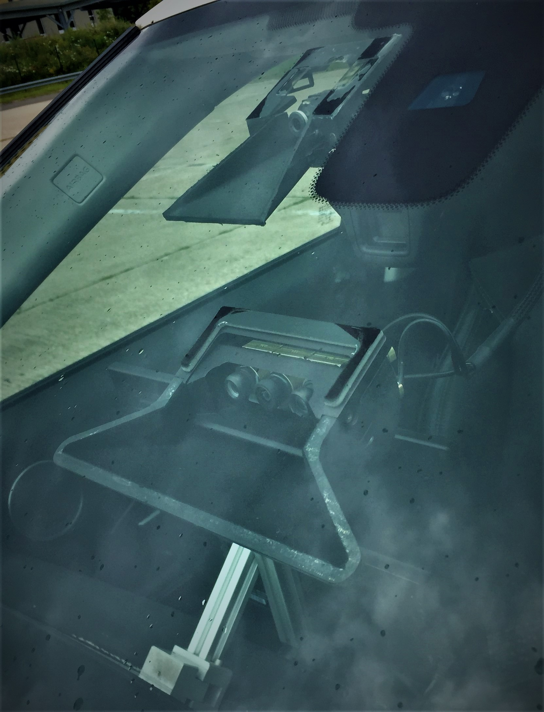  |
|:--:|
| *anti_reflexion_casing.JPG* |

| 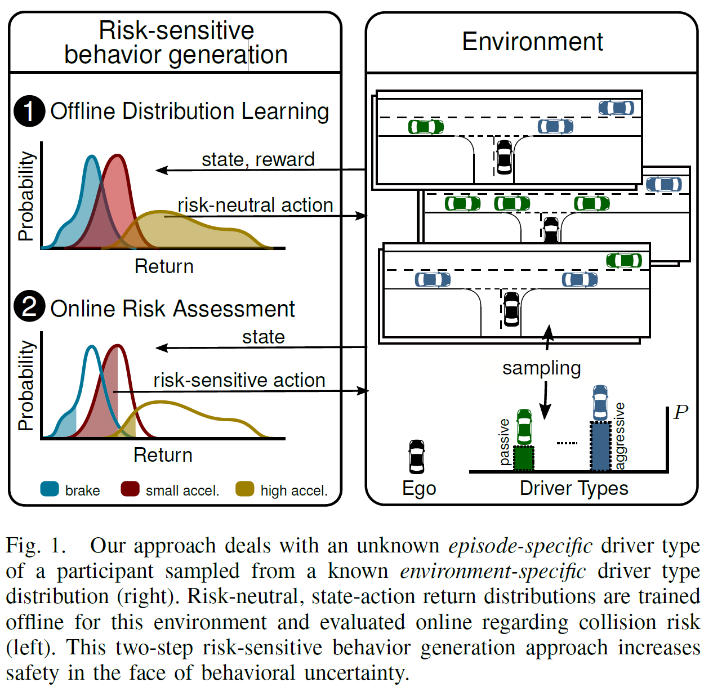  |
|:--:|
| *bernhard_distribution.PNG* |

|   |
|:--:|
| *bouton_generalization.PNG* |

|   |
|:--:|
| *chatrenet_automation_vs_fatalities.PNG* |

| 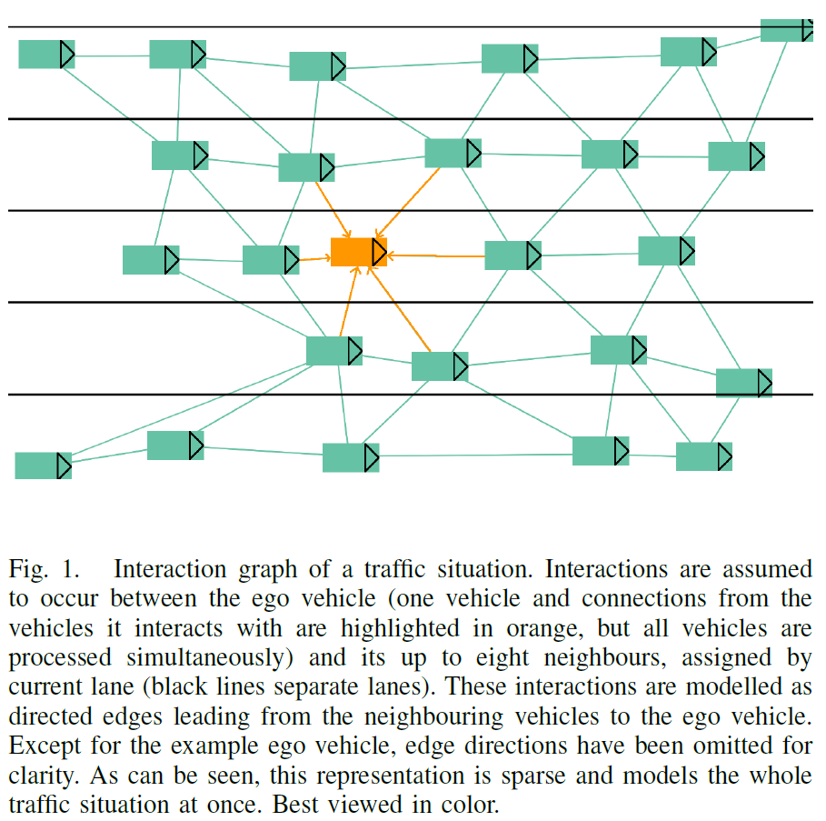  |
|:--:|
| *diehl_interaction_graph.PNG* |

|   |
|:--:|
| *driggs_informative_vs_robust.PNG* |

| 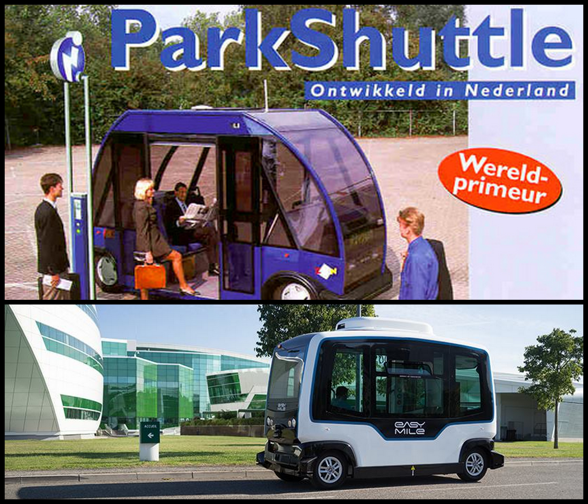  |
|:--:|
| *easymile_vs_park_shuttle.jpg* |

|   |
|:--:|
| *esterle_overview.PNG* |

|   |
|:--:|
| *folkers_attention.PNG* |

|   |
|:--:|
| *folkers_hybrid_input.PNG* |

|   |
|:--:|
| *folkers_perception_map.PNG* |

| 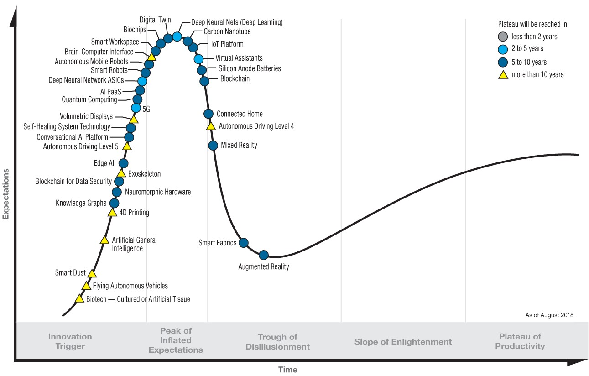  |
|:--:|
| *gartner18.jpg* |

| 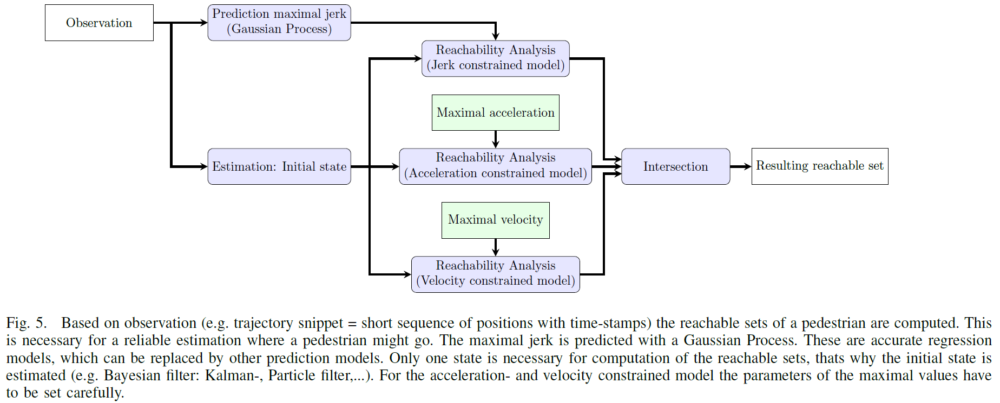  |
|:--:|
| *hartmann_sets_for_planning.PNG* |

| 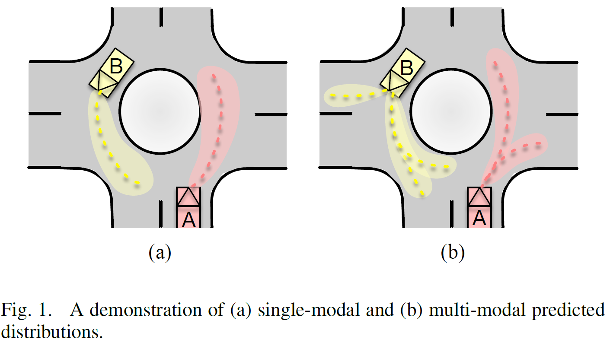  |
|:--:|
| *hu_multimodal.PNG* |

|   |
|:--:|
| *hubmann_contruction_belief_tree.PNG* |

|   |
|:--:|
| *iav_rain.jpg* |

|   |
|:--:|
| *joonatan_CVAE.png* |

|   |
|:--:|
| *kit_back_trunk.JPG* |

|   |
|:--:|
| *kit_cooling_system.JPG* |

| 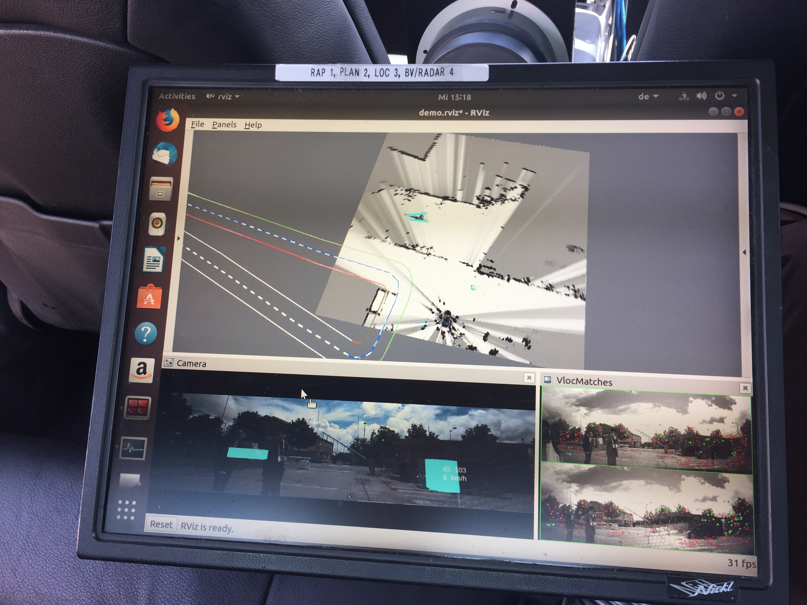  |
|:--:|
| *kit_rviz.JPG* |

|   |
|:--:|
| *kochenderfer_pomdp_checker.jpg* |

| 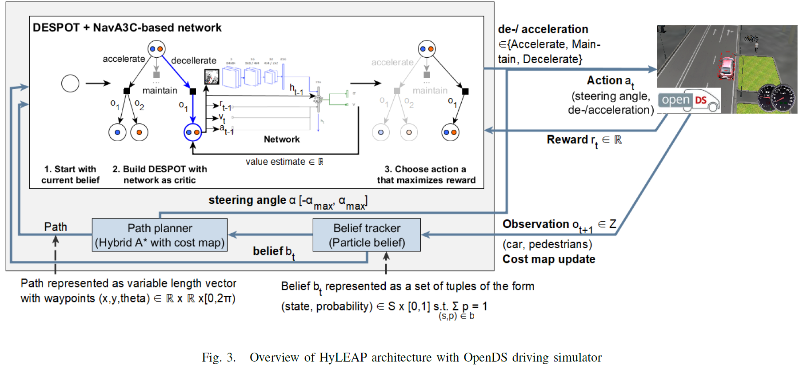  |
|:--:|
| *pusse_architecture.PNG* |

|   |
|:--:|
| *pusse_tree.PNG* |

|   |
|:--:|
| *queiroz_geoScenario_tool.jpg* |

|   |
|:--:|
| *rehder_DBN.PNG* |

| 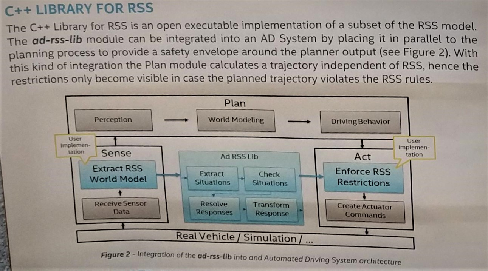  |
|:--:|
| *rss_lib.jpg* |

|   |
|:--:|
| *rss_principles.jpg* |

|   |
|:--:|
| *schörner_pomdp.PNG* |

|   |
|:--:|
| *schratter_belief.PNG* |

|   |
|:--:|
| *schratter_NCAP.PNG* |

|   |
|:--:|
| *schratter_risk_assessement.PNG* |

|   |
|:--:|
| *schulz_heteroscedastic.PNG* |

|   |
|:--:|
| *stiller_keynote.jpg* |

| 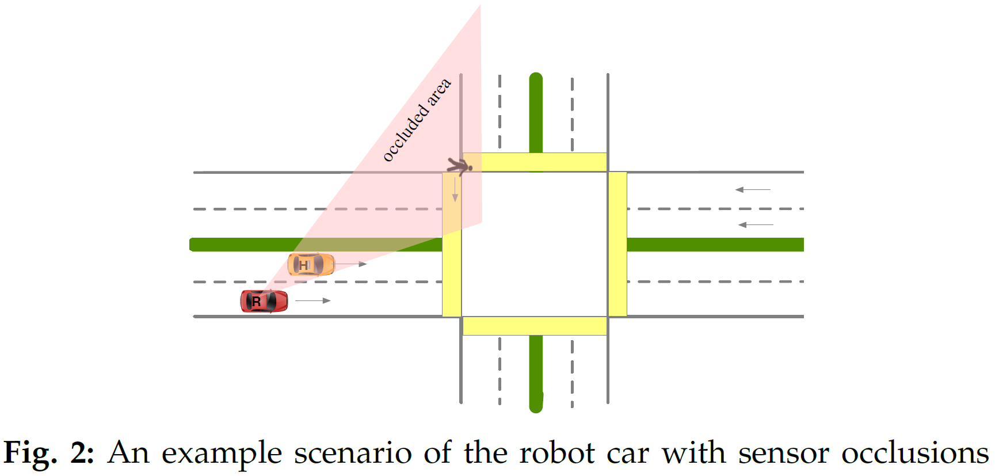  |
|:--:|
| *sun_social_perception.PNG* |

|   |
|:--:|
| *valeo.JPG* |

|   |
|:--:|
| *vöge_keynote.JPG* |

|   |
|:--:|
| *vöge_sharing.jpg* |

|   |
|:--:|
| *weast_keynote.jpg* |

|   |
|:--:|
| *weast_rss.jpg* |

|   |
|:--:|
| *zernetsch_uncertainty_in_prediction.PNG* |
