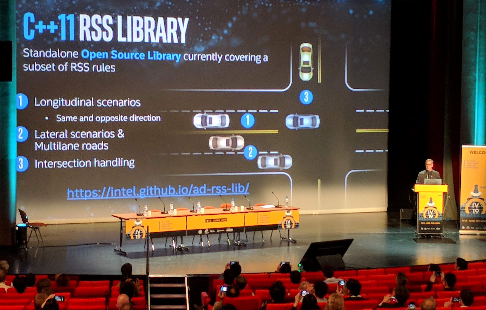
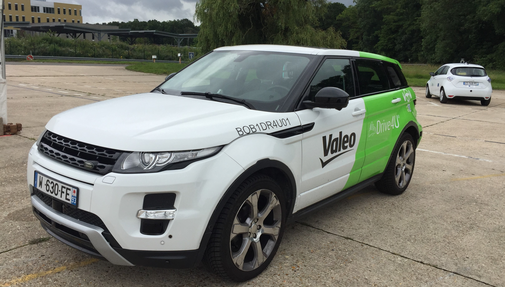
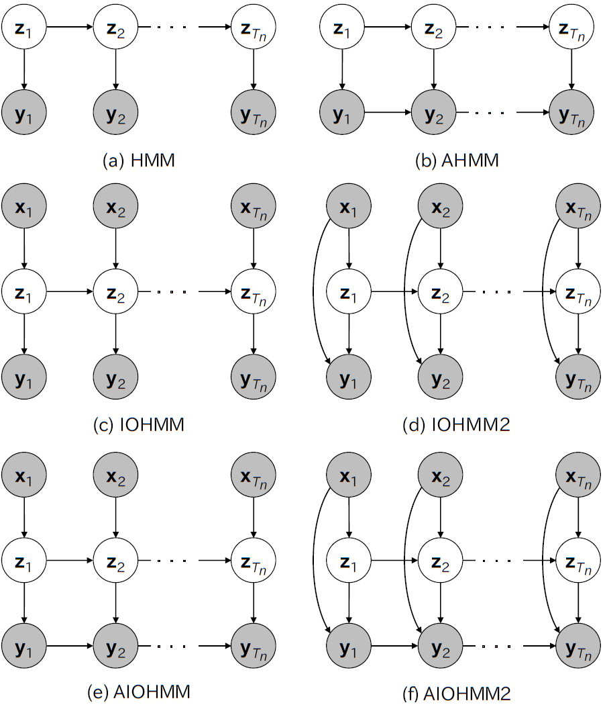
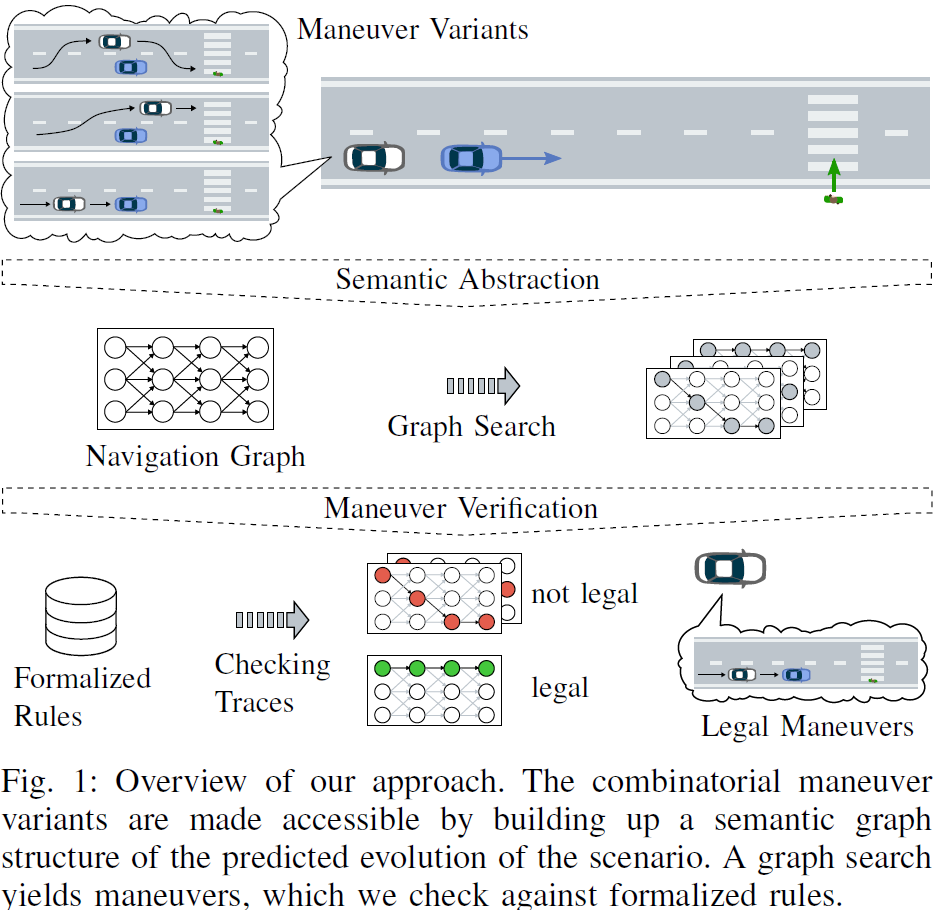
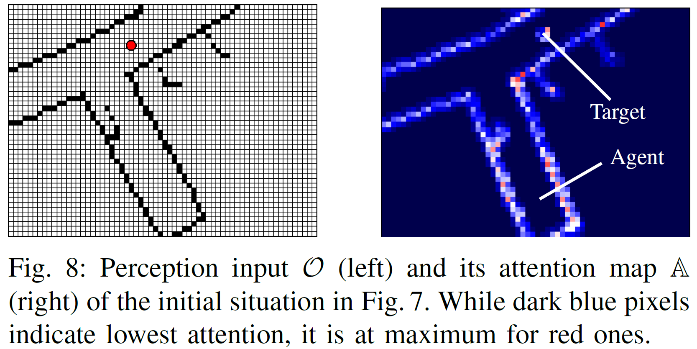
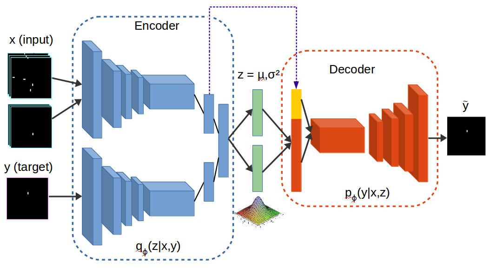

# My 10 takeaways from the 2019 Intelligent Vehicle Symposium

!!!! WORK IN PROGRESS !!!!
*If some pictures are not loaded, try to refresh the page.*

|   |
|:--:|
| *2019 Intelligent Vehicle Symposium* |

```TL; DR

- Look how other industries (e.g. aviation) deal with risk assessment and decision making under uncertainty.
- Abandon the *Vision Zero* buzzword.
- Stop separating prediction and planning and use POMDP formulations.
- Combine learning and planning (e.g. MCTS + RL).
- Interaction-aware planning.
- Think distribution, not expectation or point-estimate.
- Generalize with decomposition or image-like states.
- Some demos were impressive. But far from series production.
- ... # todo
```

Last week, experts from the autonomous driving (AD) world came together for the 2019 IEEE Intelligent Vehicle Symposium ([IV19](https://iv2019.org/)) in Paris to discuss about research and applications for autonomous driving.

This **30th edition** included one full day of **workshops and tutorials**, two days of **oral presentations**, **poster sessions** and **keynotes** as well as one whole day of **on-track demonstrations**. Not to mention the several **social events** that were ideal for deeper discussions and intense debates.

Some interesting figures:

- Around `700` attendees.
- `525` paper submissions.
- `62%` acceptance rate.
- More than `1100` reviewers.
- Authors coming from `37` countries, with almost **one third from Germany**, `16%` China, `14%` USA, `7%` France, `5%` Japan. *I sometime felt more in Germany than in France!*

From the [List of Events for Autonomous Driving Engineers and Researchers](https://github.com/esrlabs/Conferences-for-Autonomous-Driving), IV was identified as a top priority for our [Machine Learning Team](https://www.esrlabs.com/works/autonomous/). I would like to **thank [ESR Labs AG](https://www.esrlabs.com)** for this opportunity to exchange, during four days, with other engineers, researchers, practitioners, and students, from industry, universities and government agencies about the latest trends, insights and challenges related to the fast-moving field of AD.

In this post, I would like to **share some personal highlights** about the latest exciting trends in decision making for autonomous driving.

Disclaimers:

- These notes are **personal highlights** and do **not aim at being an exhausted review** of the IV19 publications.
- I mainly focus on the topic of **decision making for AD** (as opposed to perceptions, localisation or control for instance).
- Many subjects I am discussing are new to me. I really hope I did not misinterpret any concept when referencing to papers. Please notify me if any statement or interpretation is incorrect!

## Reinforcement Learning

## Partially Observable Markov Decision Process (POMDP)

## Social Benefits of AD

## Uncertainty

## Do not foget Safety

> “10 years ago, it was often said *Safety is not for research. It is for serious production*. Now, research cares about it.”

[Functional safety](https://en.wikipedia.org/wiki/Functional_safety) was a new topic for me. I guess I was not the only one:

> "Academics love to be distracted by a future in which self-driving vehicles make life-or-death decisions while moving at high speed. Whether the robot trolley will crash into the businessman or the older woman is the question of the day." [Source](https://www.nature.com/articles/d41586-019-01473-3)

This topic was new to me. I have heard of:

- Safety Validation for AD
- RSS
- Model Checkers
- Reachability sets

### Safety Proof for AD

One big question was: _**"How to prove safety in AD?"**_

This question was addressed by Jack Weast, Vice President at Mobileye, in his keynote “An Open, Transparent, Industry-driven Approach to AV Safety”.

|   |
|:--:|
| *Keynote by Jack Weast. Source: author provided.* |

What do you want to mean by *safety*? Let us start by the definition _"AV is safe if it_ **doesn’t experience collisions**_"_.

**A first intuition could be to use statistics**. For instance, with an **expectation over the distance between two accidents**. That could be computed using the total number of accidents and the total distance travelled. But only considering the statistical argument is not a good metric, since **it does not capture the scenario complexity**. One kilometre driven in Paris, on narrow streets, with all these crazy electric scooters and reckless pedestrians cannot be fairly compared with drives on large and straight highways. And the Paris example seems easy compared to some situations in India. Not to mention the weather and day/night conditions.

A second intuition could be to just **make the vehicle follow the traffic rules and prove it always abides to them**. But following the rules is not enough to avoid a crash. Moreover, it can be sometimes **socially accepted and safer to break a traffic rule**. For instance, when crossing a solid line to takeover a badly-parked vehicle.

What about **testing the vehicle on many critical scenarios**? Potentially using simulation. Thousands of thousands of scenarios can be generated and tested. But **the world is complex, and humans are imaginative**. There will always be yet another critical scenario that has not been considered before.

Another idea could be to **try to avoid crashes** at all cost. And to (try to) prove it to the authorities. But this is not realistic. Imagine you are surrounded by cars that are coming together close to you. **Avoiding accidents is just impossible**.

| .](media/pics/rss_absolute_safety_impossible.PNG "Mobileye RSS and Nvidia SFF agree: an absolute safety is impossible as long as AVs share the road with human drivers. [Source](https://newsroom.intel.com/wp-content/uploads/sites/11/2019/03/Intel-SFFvsRSS-table.pdf).")  |
|:--:|
| *Mobileye RSS and Nvidia SFF agree: an absolute safety is impossible as long as AVs share the road with human drivers. [Source](https://newsroom.intel.com/wp-content/uploads/sites/11/2019/03/Intel-SFFvsRSS-table.pdf).* |

> Another definition is hence suggested: _"AV is safe if it_ **doesn’t cause collisions**_"_.

Instead of defining scenarios in advance or trying to avoid all collisions, Jack Weast suggested to **put constraints on the driving policy**, i.e. the decision making system, which leads to the introduction of **RSS**.

### RSS

Intel, as the Platinum sponsor, could advertise the mathematical model for AV safety named [Responsibility-Sensitive Safety](https://www.mobileye.com/responsibility-sensitive-safety/) (RSS) developed by its subsidiary Mobileye. The main idea of RSS is **to mimic human judgement using math formulation**. It acts like a **safety checker on the proposed actions** and can let them proceed on the actuators or not.

While RSS starts to become popular among the AD community, it seems it has already [inspired Nvidia](https://newsroom.intel.com/editorials/innovation-requires-originality/#gs.kiu5nl). 😉

[](http://www.youtube.com/watch?v=EceAB6TUYzo "Introduction to RSS")

First, RSS is based on the **notion of "blame"**: *ensure that the AV does not initiate any dangerous situation*.

This concept is implemented in (Naumann et al. 2019) for motion planning under occlusions, where two safety conditions are defined.

- (C1) Being in a **safe state before** the conflict zone.
- (C2) **Safely passing** the conflict zone.

Only trajectories that fulfil both can be selected, as stated by their authors:

> If we cannot ensure a safe trajectory through a conflict zone, we must ensure the reachability of a safe state before it.

I will remember a second idea of RSS: the model of **human implicit rules**.

Humans follow two kind of rules:

- **Explicit rules**. Such as *“should stop at a red light”*.
- **Implicit rules**. For instance, the US law says that you should drive at a *speed that is appropriate to the traffic condition*.

RSS model human implicit rules with **five principles**.

|   |
|:--:|
| *The five RSS principles meant to formularize human common sense. As opposed to explicit rules, they are subjective and open to interpretation. Source: author provided.* |

In addition to *concept of blame* and the *five human implicit rules*, I noted that **the RSS checker is based on parametrized models**. This can be shown by the presence of equations on the above picture (sorry - it is hard to see). This parametrization offers opportuinities and challenges.

- **Driving is cultural**. Regulators and governments can **plug in different numbers**, based on what they want. RSS can be **used as a metric**.
- But **estimating the RSS parameters can be complicated**. How would you estimate the **maximum braking capability** of the vehicle in front of view? The same as yours? The average on the market? What if it is a sport car with higher braking capabilities? This value, usually denoted by `β max`, plays a significant role in the model since it conditions the safe gap distance.

|   |
|:--:|
| *Presentation of AD-RSS-LIB. Source: author provided.* |

Finally, I have retained two main announcements from RSS:

- First, RSS will use the **KITTI dataset to infer RSS parameters** that best fit to the recorded human drivers. It made me think of Inverse RL approaches which aim at finding the reward function of an MDP, given some optimal demonstration. This will be particularly useful to offer a **more realistic** (yet German specific) model. But the question of `β max` will still remain.
- IV19 was the opportunity for Jack Weast to mention the release of a [library](https://intel.github.io/ad-rss-lib/) that provides a C++ implementation of RSS. It comes with support for integration with Baidu Apollo and CARLA.


| .")  |
|:--:|
| *First, the perceived information needs to be extracted according to the RSS world model. The RSS module provides then actuator command restrictions as output to enforce safe behaviour. The checker can be placed at several location: within the behaviour planner, around the planning module or outside the AD (CARLA example).* |


## Scenario, Dataset and Performance Metric decision making

## Generalization in decision modules

## Considering interaction between traffic participants

## Learning-based versus Non-Learning-based Approaches for decision making

## Demonstrations

> “In Theory There Is No Difference Between Theory and Practice.”

Last day was test day! Companies, universities and research institutes were invited to demonstrate technological achievements in AD.

I could assist to most demonstrations. Here are some highlights.

No public HD-map was available for the test tracks. Most exhibitors had been mapping the environment the days before. And localisation was based on feature matching with radar (IRSTEA - Institut Pascal), Lidar (Valeo) or Camera (KIT).

|   |
|:--:|
| *Key-point detections shown on grayscale stereo images in the camera-only localisation system of KIT. Red points are detections that are not matching features extracted from the previously constructed map. Source: author provided* |

Several **heavy rainfalls** rhythmed the day. Fortunately, we could seek shelter under tents. IAV’s demo was interrupted to protect the sensors placed on the roof. Meanwhile, the KIT car could keep driving under the rain but must then stop as the sun reappeared because  **reflexions on the road** were fooling its **camera-based localisation**.

|   |
|:--:|
| *Roof sensors of the IAV GmbH vehicle had to be specially protected from rain. Source: author provided.* |

A research team from [TU Delft](http://intelligent-vehicles.org/research/projects/) presented their work on [SafeVRU](https://www.swov.nl/en/project/safevru-safe-interaction-automated-vehicles-vulnerable-road-users), a platform for interaction with *Vulnerable Road Users* (**VRUs**). In the scenario, a pedestrian was entering laterally the path of the AD vehicle. The main goal of the demo was **to detect if the pedestrian saw the car or not**. In the first drive, **no eye contact had been detected**, and an avoidance manoeuvre was performed. In the second drive, the head of the dummy was oriented toward the vehicle that **could detect its sight** *(green confidence at the bottom-left corner)*. The AD vehicle could **deduce that the pedestrian will stop** *(this is a strong assumption)* and consequently did not take an avoidance manoeuvre. With the increasing trend of [Smombie](https://en.wikipedia.org/wiki/Smartphone_zombie), this type of intersection might probably become difficult to capture.

|   |
|:--:|
| *Second drive of TU Delft. This time the walking dummy is looking at us. Source: author provided.* |

A research team from KIT also demonstrated perception and planning in presence of VRUs. It **detects a bicycle** in the right lane and decides to **overtake it, going to the opposite lane**.

|   |
|:--:|
| *Some issues with the localisation system caused the overtaking manoeuvre to be a little bit abrupt. Source: author provided.* |

|   |
|:--:|
| *Back trunk of the KIT car. Source: author provided.* |

|   |
|:--:|
| *Air-cooling hose coming from the back trunk of KIT car. Source: author provided.* |

The European project [AutoMate](http://www.automate-project.eu/) project demonstrated **collaboration between the AD vehicle and the human driver** (hence suffix *“mate”* for *“teammate”*). When approaching a roundabout, the human driver, whose attention is constantly monitored, was **asked to take over the lateral control**, i.e. the steering commands. An explanation for this request was given on the onboard display. After exiting the roundabout, the system **proposed to resume the AD mode**.

I found a little bit impressive to drive at 70 km/h on a countryside-like road with the AD mode.

|   |
|:--:|
| *AD system asking for human collaboration when "approaching" a roundabout. Source: author provided.* |

This demonstration raises questions about the cooperation between human driver and the autopilot. Here, the driver cannot be described as “distracted”. He was paying much attention and could therefore quickly take over.

In addition, only one request was submitted during the test. I can imagine it could be **annoying to be repetitively asked** for collaboration. That reminded me an oral session, where a reference to [The Boy Who Cried Wolf fable](https://en.wikipedia.org/wiki/The_Boy_Who_Cried_Wolf) was made to highlight the **risk of false alarms**: too many unnecessary warnings and calls for disengagement **might discourage driver vigilance**.

Another thing I noticed is the **central display**. It is supposed to **inform the driver about the reason of disengagement**. But it may be not easy to understand, especially given the of risk/importance of the situation and the short time available to react. **OEMs still must prove** that **handover** of vehicle control can be done **safely**, **intuitively**, without **“disrupting user experience”**. 😉

> To me, it is harder to monitor the autopilot than to drive on my own.

This also raises the question of the **driving licence**. In the aviation domain, pilots are trained to handle such transitions and to collaborate. Introducing **level-3 vehicles** (sometimes called *“conditionally-automated”*) in hands of **untrained people** is questionable. In the debate over **supervised vs unsupervised driving modes**, multiple OEMs have already announced they will **skip level-3**, arguing that **this handover of control is unsafe**.

A research team from UTC presented a **cooperative communication** between two vehicles for roundabout crossing. When arriving at the entrance, our vehicle **agreed** with the vehicle driving on roundabout **who should go first**. This V2V solution removes the need for the **challenging inference of intention**. Given **all participants are connected**.

|   |
|:--:|
| *V2V communication for roundabout crossing. Source: author provided.* |

I felt very comfortable on the forest track driven by the Valeo [Drive4U® Urban Pilot](https://www.valeo.com/en/valeo-drive4u-the-first-autonomous-car-to-be-demonstrated-on-the-streets-of-paris/). Moreover, and compared to other AD demonstrators, all sensors were embedded and there was almost no cable visible in the vehicle cabin. And they did not hide everything in the back trunk. 😉

|   |
|:--:|
| *Valeo Drive4U® Urban Pilot. Source: author provided.* |

PSA did not show any prototype. Instead I could test a pre-series car with ADAS features like *Autonomous Emergency Braking* (AEB). **AEB was demonstrated with a static target**. From the passenger seat, I found the braking manoeuvre impressive, even at **25km/h**. The car managed to stop before the static "dummy" *(yes, this is the term)* without any contact (approx. one-meter gap).

|   |
|:--:|
| *AEB at 25 km/h with a static dummy. Source: author provided.* |

### Miscellaneous Comments

| . Convenient to display multiple windows. Source: author provided.](media/pics/kit_rviz.JPG "Most teams were using ROS (ROS1 or ROS2) and the related visualization tool [RViz](http://wiki.ros.org/rviz). Convenient to display multiple windows. Source: author provided.")  |
|:--:|
| *Most teams were using ROS (ROS1 or ROS2) and the related visualization tool [RViz](http://wiki.ros.org/rviz). Convenient to display multiple windows. Source: author provided.* |

|   |
|:--:|
| *Most teams were using 3D-printed black casings to prevent reflexion from the dashboard in their cameras. Source: author provided.* |

Another comment, about the type of the presented AD vehicles. Most were car-like. And during the four days of workshop, conference and demonstration, I was surprise not to see more **AD applications for trucks**. Due to its **market size** and its **market value**, and considering he **might present lighter technical challenges** than for AD cars, self-driving trucks are sometimes [predicted to be first to market](https://medium.com/redpoint-ventures/why-self-driving-trucks-will-be-first-to-market-and-why-we-invested-in-ike-6a8f8114c8ec). Nevertheless, **truck applications were almost absent from IV19**. If they were used multiple times as slow dynamic obstacles to avoid, the term “truck” was present in only seven abstracts.

### Discussions With Some Sponsors

Several sponsors were presented solution during the conference. I talked to two of them. Sorry, I do not have anything to show here.

[Intempora](https://intempora.com/) presented, among other, its [Intempora Validation Suite](https://intempora.com/products/ivs-intempora-validation-suite.html) (IVS). No, it does not stand for "Intelligent Vehicle Symposium". 😜

IVS allows to centralize, store and share **recorded sensor data**. Descriptions of the driving situations are added. It is then possible to **search for a specific traffic situation**. Convenient for **regression tests** and for **debugging**.

I was showed how to **quickly retrieve all recorded highway scenarios** where the ego-car was driving on the **left-lane**, with a speed **higher than 110km/h**, while **taking over a truck**. Obviously the quality of this **tag-based search relies on annotations**. They can be done online or offline.

EasyMile and safety validation.

I really enjoyed discussing with some of the engineers from EasyMile! They stressed the importance of the **development process** for **safety validation**. They took the example of the aviation domain where some **sensors must be made redundant** and must even originate from two different manufacturers. This is currently not the case for AD where, despite multi-modality in perception, there is usually one single camera per direction. What is more important to the safety validation authorities is **how the full system has been developed**. In particular the **“safety checker”** that **runs in parallel to the driving functions** must have been **developed independently** of these driving functions, by an **independent team**.

## Conclusion

Tom Vöge ended his keynote with a **gentle joke to EasyMile**. He mentioned the EU-funded project [parkshut](https://staff.washington.edu/jbs/itrans/parkshut.htm) to was developing an AD shuttle service. The park shuttle was released to the public in April 1999. He said:

> “Twenty years later we are still at the same point with AD: demonstration”.

|  - [bottom](https://www.facebook.com/EasyMile/).](media/pics/easymile_vs_park_shuttle.jpg "ParkShuttle (1999) and EasyMile (2019). Sources: [top](https://staff.washington.edu/jbs/itrans/parkshut.htm) - [bottom](https://www.facebook.com/EasyMile/).")  |
|:--:|
| *ParkShuttle (1999) and EasyMile (2019). Sources: [top](https://staff.washington.edu/jbs/itrans/parkshut.htm) - [bottom](https://www.facebook.com/EasyMile/).* |

This is a little bit unfair for EasyMile since they are one of the very few to already operate AD vehicles with public. But this punchy conclusion reminded everyone that **we still have a long way to go before AD exit, and become beneficial for the society**.

## A Last Word

IV19 was my first scientific symposium. I could meet leading-edge researchers and engineers in my domain of interest while broadening my perspectives on other AD topics.

Again, many thanks at [ESR Labs AG](https://www.esrlabs.com) for this great opportunity. I am now looking forward to implementing the learnt lessons to [some of our projects](https://www.esrlabs.com/works/autonomous).

### Save The Date - an some dollars :bowtie:

[IV20](https://2020.ieee-iv.org/) will take place in Las Vegas, June 23-26, while Japan will host IV21, with probably a lot of amazing demos to show after the 2020 Olympics.

|   |
|:--:|
| *Brendan Morris advertising IV20. Source: author provided* |

## References

Akai, Naoki et al. [2019].
**“Driving Behavior Modeling Based on Hidden Markov Models with Driver’s Eye-Gaze Measurement and Ego-Vehicle Localization”**
[[pdf](https://www.researchgate.net/publication/332543438_Driving_Behavior_Modeling_Based_on_Hidden_Markov_Models_with_Driver%27s_Eye-Gaze_Measurement_and_Ego-Vehicle_Localization)]

Alahi, Alexandre et al. [2016].
**“Social LSTM: Human Trajectory Prediction in Crowded Spaces”**
[[pdf](http://cvgl.stanford.edu/papers/CVPR16_Social_LSTM.pdf)]

Barbier, Mathieu et al. [2019].
**“Validation of Perception and Decision-Making Systems for Autonomous Driving via Statistical Model Checking”**
[[pdf](https://hal.inria.fr/hal-02127889/document)]

Barbier, Mathieu, Christian Laugier, Olivier Simonin, and Javier Ibanez-Guzmin. [2018].
**“Probabilistic Decision-Making at Road Intersections: Formulation and Quantitative Evaluation”**
[[pdf](https://hal.inria.fr/hal-01940392/document)]

Bernhard, Julian, and Alois Knoll. [2019].
**“Addressing Inherent Uncertainty: Risk-Sensitive Behavior Generation Using Distributional Reinforcement Learning”**
[[html](https://mediatum.ub.tum.de/node?id=1485138)]

Bouton, Maxime, Alireza Nakhaei, Kikuo Fujimura, and Mykel J Kochenderfer. [2019].
**“Safe Reinforcement Learning with Scene Decomposition for Navigating Complex Urban Environments”**
[[pdf](https://arxiv.org/abs/1904.11483)]

Chauvin, Simon. [2018].
**“Hierarchical Decision-Making for Autonomous Driving”**
[[pdf](https://github.com/chauvinSimon/Hierarchical-Decision-Making-for-Autonomous-Driving)]

Chen, Jianyu, Bodi Yuan, and Masayoshi Tomizuka. [2019].
**“Model-Free Deep Reinforcement Learning for Urban Autonomous Driving”**
[[pdf](http://arxiv.org/abs/1904.09503)]

Chen, Longsheng et al. [2019].
**“An Adaptive Path Tracking Controller Based on Reinforcement Learning with Urban Driving Application”**
[-]

Diehl, Frederik, Thomas Brunner, Michael Truong Le, and Alois Knoll. [2019].
**“Graph Neural Networks for Modelling Traffic Participant Interaction”**
[[pdf](https://arxiv.org/abs/1903.01254)]

Driggs-Campbell, Katherine, Roy Dong, S. Shankar Sastry, and Ruzena Bajcsy. [2017].
**“Robust, Informative Human-in-the-Loop Predictions via Empirical Reachable Sets”**
[[pdf](https://arxiv.org/abs/1705.00748)]

Esterle, Klemens, Vincent Aravantinos, and Alois Knoll. [2019].
**“From Specifications to Behavior: Maneuver Verification in a Semantic State Space”**
[[pdf](https://arxiv.org/abs/1905.00708)]

Folkers, Andreas, Matthias Rick, and B Christof. [2019].
**“Controlling an Autonomous Vehicle with Deep Reinforcement Learning”**
[-]

Hartmann, Michael, and Daniel Watzenig. [2019].
**“Optimal Motion Planning with Reachable Sets of Vulnerable Road Users”**
[-]

Hoel, Carl-Johan et al. [2019].
**“Combining Planning and Deep Reinforcement Learning in Tactical Decision Making for Autonomous Driving”**
[[pdf](https://arxiv.org/abs/1905.02680)]

Hu, Yeping, Wei Zhan, and Masayoshi Tomizuka. [2019].
**“Multi-Modal Probabilistic Prediction of Interactive Behavior via an Interpretable Model”**
[[pdf](https://arxiv.org/abs/1903.09381)]

Hubmann, Constantin et al. [2019].
**“A POMDP Maneuver Planner For Occlusions in Urban Scenarios”**
[-]

Joonatan, Mänttäri, and John Folkesson. [2019].
**“Incorporating Uncertainty in Predicting Vehicle Maneuvers at Intersections With Complex Interactions”**
[-]

Kang, Yue, Hang Yin, and Christian Berger. [2018].
**“Test Your Self-Driving Algorithm : An Overview of Publicly Available Driving Datasets and Virtual Testing Environments”**
[[pdf](https://www.researchgate.net/publication/331723628_Test_Your_Self-Driving_Algorithm_An_Overview_of_Publicly_Available_Driving_Datasets_and_Virtual_Testing_Environments)]

Kapania, Nitin R., Vijay Govindarajan, Francesco Borrelli, and J. Christian Gerdes. [2019].
**“A Hybrid Control Design for Autonomous Vehicles at Uncontrolled Crosswalks”**
[[pdf](https://arxiv.org/abs/1902.00597)]

Klischat, Moritz, and Matthias Althoff. [2019].
**“Generating Critical Test Scenarios for Automated Vehicles with Evolutionary Algorithms”**
[[pdf](https://www.researchgate.net/publication/333186174_Generating_Critical_Test_Scenarios_for_Automated_Vehicles_with_Evolutionary_Algorithms)]

Koenig, Alexander, Tobias Rehder, and Soeren Hohmann. [2017].
**“Exact Inference and Learning in Hybrid Bayesian Networks for Lane Change Intention Classification”**
[[html](https://ieeexplore.ieee.org/document/7995927/)]

Kong, Jason, Mark Pfeiffer, Georg Schildbach, and Francesco Borrelli. [2015].
**“Kinematic and Dynamic Vehicle Models for Autonomous Driving Control Design”**
[[pdf](https://borrelli.me.berkeley.edu/pdfpub/IV_KinematicMPC_jason.pdf)]

Lee, Namhoon et al. [2017].
**“DESIRE : Distant Future Prediction in Dynamic Scenes with Interacting Agents”**
[[pdf](https://arxiv.org/abs/1704.04394)]

Li, Jiachen, Hengbo Ma, Wei Zhan, and Masayoshi Tomizuka. [2019].
**“Coordination and Trajectory Prediction for Vehicle Interactions via Bayesian Generative Modeling”**
[[pdf](http://arxiv.org/abs/1905.00587)]

Li, Yang et al. [2019].
**“Pedestrian Trajectory Prediction With Learning-Based Approaches : A Comparative Study”**
[-]

Ma, Hengbo, Jiachen Li, Wei Zhan, and Masayoshi Tomizuka. [2019].
**“Wasserstein Generative Learning with Kinematic Constraints for Probabilistic Prediction of Interactive Driving Behavior”**
[-]

Naumann, Maximilian, Hendrik Königshof, Martin Lauer, and Christoph Stiller. [2019].
**“Safe but Not Overcautious Motion Planning under Occlusions and Limited Sensor Range”**
[[pdf](https://www.mrt.kit.edu/z/publ/download/2019/Naumann2019Occlusions.pdf)]

Orzechowski, Piotr F, Annika Meyer, and Martin Lauer. [2018].
**“Tackling Occlusions & Limited Sensor Range with Set-based Safety Verification”**
[[pdf](https://arxiv.org/abs/1807.01262)]

Pierson, Alyssa, Wilko Schwarting, Sertac Karaman, and Daniela Rus. [2019].
**“Learning Risk Level Set Parameters from Data Sets for Safer Driving”**
[-]

Pool, Ewoud A I, Julian F P Kooij, and Dariu M Gavrila. [2019].
**“Context-Based Cyclist Path Prediction Using Recurrent Neural Networks”**
[-]

Pusse, Florian, and Matthias Klusch. [2019].
**“Hybrid Online POMDP Planning and Deep Reinforcement Learning for Safer Self-Driving Cars”**
[[html](https://www.dfki.de/en/web/research/projects-and-publications/publications/publication/10337/)]

Queiroz, Rodrigo, Thorsten Berger, and Krzysztof Czarnecki. [2019].
**“GeoScenario : An Open DSL for Autonomous Driving Scenario Representation”
[[pdf](http://www.cse.chalmers.se/~bergert/paper/2019-iv-geoscenario.pdf)]

Rehder, Tobias et al. [2019].
**“Lane Change Intention Awareness for Assisted and Automated Driving on Highways”**
[[html](https://www.researchgate.net/publication/331913422_Lane_Change_Intention_Awareness_for_Assisted_and_Automated_Driving_on_Highways)]

Schörner, Philip, T Lars, Jens Doll, and J Z Marius. [2019].
**“Predictive Trajectory Planning in Situations with Hidden Road Users Using Partially Observable Markov Decision Processes”**
[[pdf](https://www.ifr.ing.tu-bs.de/static/files/forschung/papers/download_pdf.php?id=739)]

Schratter, Markus, Maxime Bouton, Mykel J. Kochenderfer, and Daniel Watzenig. [2019].
**“Pedestrian Collision Avoidance System for Scenarios with Occlusions”**
[[pdf](https://arxiv.org/abs/1904.11566)]

Schulz, Jens et al. [2019].
**“Learning Interaction-Aware Probabilistic Driver Behavior Models from Urban Scenarios”**
[-]

Si, Wenwen, and Changliu Liu. [2019].
**“AGen : Adaptable Generative Prediction Networks for Autonomous Driving”**
[[html](https://www.ri.cmu.edu/publications/agen-adaptable-generative-prediction-networks-for-autonomous-driving/)]

Sun, Liting, Wei Zhan, Ching-Yao Chan, and Masayoshi Tomizuka. [2019].
**“Behavior Planning of Autonomous Cars with Social Perception”**
[[pdf](https://arxiv.org/abs/1905.00988)]

Sunberg, Zachary, and Mykel Kochenderfer. [2017].
**“Online Algorithms for POMDPs with Continuous State, Action, and Observation Spaces”**
[[pdf](https://arxiv.org/abs/1709.06196)]

Ulbrich, Simon et al. [2015].
**“Defining and Substantiating the Terms Scene , Situation , and Scenario for Automated Driving”**
[[pdf](https://www.ifr.ing.tu-bs.de/static/files/forschung/papers/download_pdf.php?id=859)]

Ure, N Kemal, M Ugur Yavas, Ali Alizadeh, and Can Kurtulus. [2019].
**“Enhancing Situational Awareness and Performance of Adaptive Cruise Control through Model Predictive Control and Deep Reinforcement Learning”**
[-]

Zernetsch, Stefan et al. [2019].
**“Trajectory Forecasts with Uncertainties of Vulnerable Road Users by Means of Neural Networks**
[-]

## Temp GIF

|   |
|:--:|
| *INTERACTION dataset* |

|   |
|:--:|
| *hubmann_occlusion.gif* |

|   |
|:--:|
| *pascal_fantassin.gif* |

|   |
|:--:|
| *pierson_risk_sets.gif* |

## Temp PICS

|   |
|:--:|
| *akai_hmm_types.png* |

|   |
|:--:|
| *bernhard_distribution.PNG* |

|   |
|:--:|
| *bouton_generalization.PNG* |

|   |
|:--:|
| *chatrenet_automation_vs_fatalities.PNG* |

|   |
|:--:|
| *diehl_interaction_graph.PNG* |

|   |
|:--:|
| *driggs_informative_vs_robust.PNG* |

|   |
|:--:|
| *esterle_overview.PNG* |

|   |
|:--:|
| *folkers_attention.PNG* |

|   |
|:--:|
| *folkers_hybrid_input.PNG* |

|   |
|:--:|
| *folkers_perception_map.PNG* |

|   |
|:--:|
| *gartner18.jpg* |

|   |
|:--:|
| *hartmann_sets_for_planning.PNG* |

|   |
|:--:|
| *hu_multimodal.PNG* |

|   |
|:--:|
| *hubmann_contruction_belief_tree.PNG* |

|   |
|:--:|
| *joonatan_CVAE.png* |

|   |
|:--:|
| *kochenderfer_pomdp_checker.jpg* |

|   |
|:--:|
| *pusse_architecture.PNG* |

|   |
|:--:|
| *pusse_tree.PNG* |

|   |
|:--:|
| *queiroz_geoScenario_tool.jpg* |

|   |
|:--:|
| *rehder_DBN.PNG* |

|   |
|:--:|
| *schörner_pomdp.PNG* |

|   |
|:--:|
| *schratter_belief.PNG* |

|   |
|:--:|
| *schratter_NCAP.PNG* |

|   |
|:--:|
| *schratter_risk_assessement.PNG* |

|   |
|:--:|
| *schulz_heteroscedastic.PNG* |

|   |
|:--:|
| *stiller_keynote.jpg* |

|   |
|:--:|
| *sun_social_perception.PNG* |

|   |
|:--:|
| *vöge_keynote.JPG* |

|   |
|:--:|
| *vöge_sharing.jpg* |

|   |
|:--:|
| *weast_keynote.jpg* |

|   |
|:--:|
| *zernetsch_uncertainty_in_prediction.PNG* |
